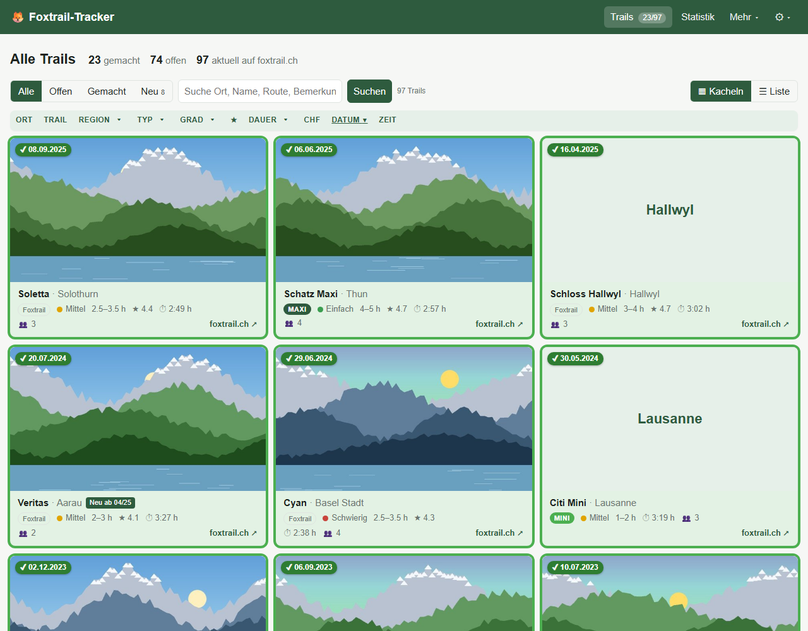
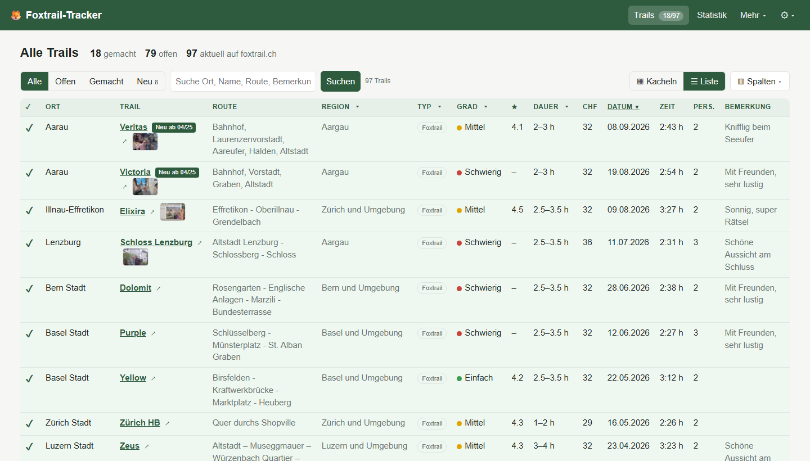
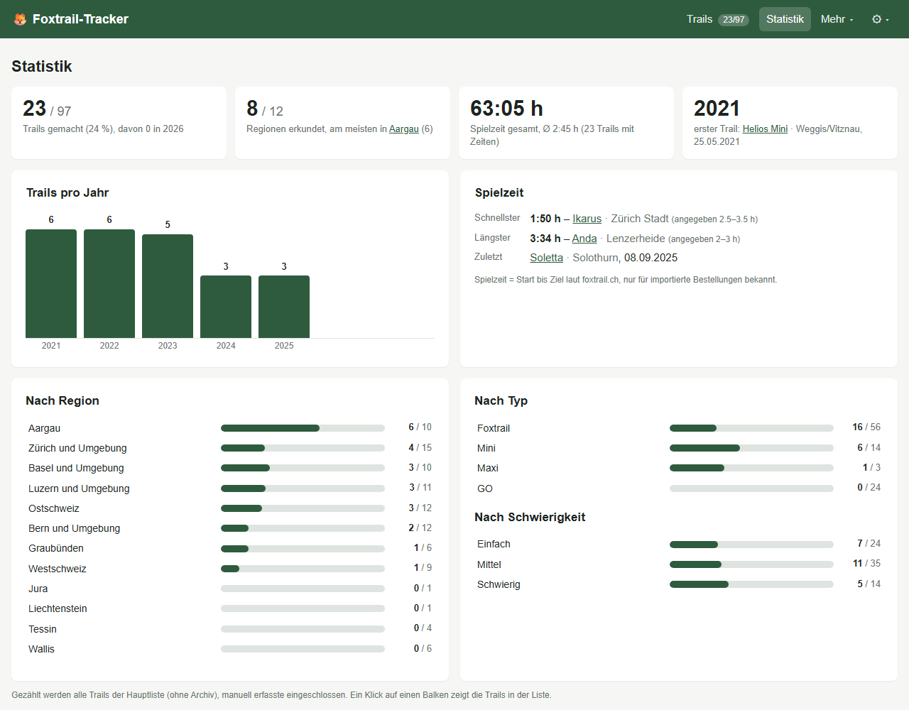
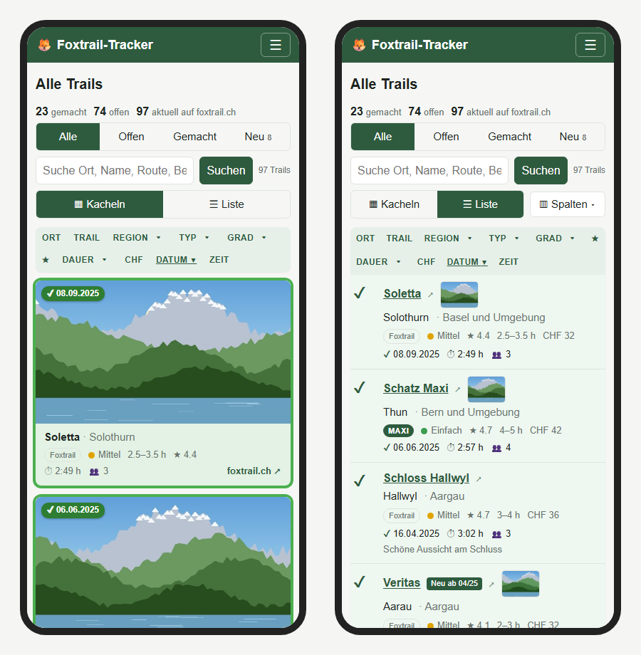

# Foxtrail-Tracker

Kleine, selbst gehostete Web-App, um den Überblick zu behalten, welche
[Foxtrails](https://foxtrail.ch) man in der Schweiz schon gemacht hat – mit
Datum, Anzahl Mitspieler und Bemerkung, für mehrere Benutzer mit Login.

Die Trail-Liste wird automatisch mit foxtrail.ch abgeglichen. Dabei geht nichts
verloren: Trails, die es nicht mehr gibt, werden nie gelöscht – bereits gemachte
bleiben in der Liste, noch offene wandern in ein Archiv.

> Dieses Projekt ist privat und **nicht** mit der Foxtrail AG verbunden. Die
> Trail-Daten (Name, Ort, Route, Dauer, Preis, Bewertung) stammen von der
> öffentlichen Übersicht auf foxtrail.ch und gehören der Foxtrail AG.

## So sieht es aus



| Liste mit wählbaren Spalten | Statistik |
|---|---|
|  |  |



<sub>Screenshots mit erfundenen Einträgen; eigene Schlussfotos und Titelbilder von
foxtrail.ch absichtlich unscharf.</sub>

## Funktionen

* Liste aller aktuell angebotenen Trails mit Filter (alle / offen / gemacht) und
  Volltextsuche; jede Spalte sortierbar (Ort, Trail, Region, Typ, Bewertung, Dauer,
  Preis, Datum), Mehrfach-Filter für Region, Typ und Dauer direkt im Spaltenkopf
* Schwierigkeitsgrad (Einfach / Mittel / Schwierig) laut foxtrail.ch als Spalte,
  sortier- und filterbar; GO-Trails haben keinen
* Typ als Badge wie auf foxtrail.ch: **Foxtrail**, **MINI**, **MAXI**, **GO** – abgeleitet
  aus dem Trail-Namen bzw. dem GO-Badge (das MINI/MAXI-Badge ist auf der Website nur
  ins Bild gezeichnet); sortiert nach Region erscheinen Gruppen-Zeilen
* Pro Trail: **gemacht**, **Datum**, **Anzahl Mitspieler**, **Bemerkung**
  (ein Eintrag je Trail, gemeinsam für alle Benutzer)
* **Spalten wählbar** (Knopf „Spalten“ in der Liste, gespeichert pro Benutzer): zusätzlich
  Startort, Zielort, Start- und Zielzeit, Team-Code, Bestellnummer, „Neu ab“ und „Erfasst von“
* **Kachelansicht** als Standardansicht (umschaltbar auf die Tabelle): so viele Kacheln pro Reihe, wie Platz haben (Laptop 3–4, Breitbild bis 8, auf dem Handy
  eine) mit dem eigenen Foto oder dem Titelbild von foxtrail.ch, Klick öffnet den Trail;
  Sortierung und Filter wie in der Liste, die gewählte Ansicht bleibt in der Sitzung; unten rechts ein Direktlink zu foxtrail.ch
* **Fotos** pro Trail: hochladen, ersetzen, löschen (JPEG/PNG/WebP bis 15 MB). Beim
  Speichern wird das Bild gedreht, auf höchstens 2560 px verkleinert und ohne
  EXIF-Daten (also ohne GPS-Position) abgelegt. In der Liste erscheint eine Vorschau
* **Bestellungen von foxtrail.ch importieren:** Link „MyAccount öffnen“ aus einer Mail von
  foxtrail.ch einfügen – Datum, Mitspieler, Start- und Zielzeit, Team-Code, Bestellnummer und
  Schlussfoto kommen automatisch, mit Vorschau vor dem Eintragen
  ([Anleitung](#bestellungen-von-foxtrailch-importieren))
* **Statistik**: gemacht von gesamt (davon im laufenden Jahr), erkundete Regionen, Spielzeit gesamt und im Schnitt,
  schnellster und längster Trail, Trails pro Jahr sowie Fortschritt je Region, Typ und
  Schwierigkeit (ein Klick auf einen Balken öffnet die passende Liste)
* Manuell erfasste Trails für früher gemachte Trails, die nicht mehr angeboten werden
* Abgleich mit foxtrail.ch – automatisch (auf der Seite Abgleich wählbar: wöchentlich, monatlich
  oder aus) und per Knopfdruck
* Archiv: nicht mehr angebotene, noch nicht gemachte Trails, mit Suche und Sortierung (Ort, Trail, Region, zuletzt gesehen)
* **Benutzerverwaltung:** Anzeigename, Sprache, „Passwort beim nächsten Login ändern“ oder „Passwort
  darf nicht geändert werden“, **Zweitfaktor** mit Authenticator-App oder Passkey (optional als
  Pflicht), Anmelde-Protokoll für Admins
* **Anmelden mit Passkey** statt Passwort (Fingerabdruck, Gesicht oder Geräte-PIN) – ohne
  Benutzernamen, der Browser sucht den passenden Passkey selbst. Entweder Passkey **oder**
  Benutzername und Passwort; eine Authenticator-App kommt dagegen immer zum Passwort dazu. Auf einem Gerät, das schon einmal
  einen Passkey benutzt hat, fragt die Anmeldeseite von selbst danach – abschaltbar mit dem
  Kästchen „Beim Öffnen automatisch fragen“
* **Sicherung:** alles in eine ZIP-Datei (Trails, Benutzer, Einstellungen, Protokolle, eigene
  Fotos) und bei einer Neuinstallation wieder einlesen – im ⚙-Menü oder auf der Konsole
  ([Anleitung](#sichern-und-wiederherstellen))
* **Darstellung** automatisch, hell oder dunkel (Knopf ◐ oben rechts)
* Mehrere Benutzer mit Login (gehashte Passwörter, Sperre nach 5 Fehlversuchen) und drei Rollen:
  **Administrator** (verwaltet Benutzer, löst den Abgleich aus, importiert Bestellungen),
  **Bearbeiten** (Trails eintragen, Fotos, manuelle Trails) und **Nur lesen** (Liste, Statistik und
  Fotos ansehen, nichts ändern; ohne Archiv, Team-Code, Bestellnummer und Rechnung)
* **Sprachen:** Deutsch, Français, Italiano, English – automatisch nach Browser, umschaltbar im ⚙-Menü
  (pro Benutzer gespeichert)
* Keine externen Abhängigkeiten im Browser (kein CDN)
* **Auf dem Smartphone** bedienbar: Menü hinter ☰ (fährt von links ein), Liste und Archiv als
  kompakte Karten statt breiter Tabelle, Sortier- und Filterleiste oben, grosse Tipp-Flächen

## Abgleich-Regeln

Die mitgelieferte Trail-Liste enthält auch 17 Trails, die foxtrail.ch früher angeboten hat
(ermittelt aus archivierten Seiten im Internet Archive, 2023–2025). Noch nicht gemachte stehen
im Archiv; wer einen davon gemacht hat, markiert ihn dort als „gemacht“. Ist einer davon
schon von Hand erfasst, wird er nicht doppelt angelegt; leere Felder (Route, Dauer, Region,
Bewertung, Preis) werden aus dem Archivstand ergänzt. Den Schwierigkeitsgrad hat das Archiv
nicht – den bei Bedarf selbst eintragen.

| Situation | Ergebnis |
|---|---|
| Trail neu auf foxtrail.ch | wird angelegt (offen), in der Liste dauerhaft „Neu ab MM/JJ“; Filter **Neu** zeigt alle, neueste zuerst |
| Trail schon im Seed, aber laut [Neuigkeiten](https://foxtrail.ch/thema/neuigkeiten/) kürzlich eröffnet | „Neu ab“ aus dem Seed (`neu_seit`), `foxtrailctl seed` trägt es auch in bestehende Datenbanken nach |
| Trail weiterhin gelistet | Metadaten (Preis, Dauer, Bewertung, Route) aktualisiert – eigene Einträge bleiben |
| Trail nicht mehr gelistet, **bereits gemacht** | bleibt in der Hauptliste, markiert „nicht mehr im Angebot seit MM/JJ“ |
| Trail nicht mehr gelistet, **noch offen** | erscheint im **Archiv** |
| Archivierter Trail wird als gemacht markiert | wandert zurück in die Hauptliste |
| Archivierter Trail taucht wieder auf | wird reaktiviert |
| Trail unter neuer Adresse, nur der Regionsteil geändert (z. B. `zuerich-und-umgebung/baccara` → `ostschweiz/baccara`) | bestehender Eintrag bekommt die neue Adresse, eigene Einträge und Fotos bleiben; kein Doppel |
| Manuell erfasster Trail | wird vom Abgleich nie verändert |

Schlüssel für den Abgleich ist der URL-Pfad des Trails auf foxtrail.ch (z. B.
`wallis/allalin-maxi`), nicht der Name. Nur bei einem Umzug (gleicher letzter Adressteil und
gleicher Name, alter Pfad nicht mehr gelistet) zählt der Name mit. Liefert der Scraper weniger als die Hälfte
der bisher bekannten Trails (Website-Umbau, Störung), bricht der Abgleich ab und
verändert nichts.

## Bestellungen von foxtrail.ch importieren

Was ihr auf foxtrail.ch gebucht und gespielt habt, übernimmt die App auf Knopfdruck: Datum,
Anzahl Mitspieler, Start- und Zielzeit (daraus die **Spielzeit**), Team-Code, Bestellnummer
und das **Schlussfoto**.

1. Eine Mail von foxtrail.ch öffnen, zum Beispiel eine Buchungsbestätigung.
2. Beim Knopf **„MyAccount öffnen“** Rechtsklick → **Link-Adresse kopieren**.
3. In der App ⚙ → **Import** (nur Administratoren) den Link einfügen und **Bestellungen abrufen**.
4. Die Vorschau zeigt für jeden Trail, was passiert. Erst **Jetzt eintragen** speichert.

Gut zu wissen:

* **Mehrere Mailadressen = mehrere Konten.** Wer mit verschiedenen Adressen bucht, hat bei
  foxtrail.ch getrennte Konten – dann die Links aus den Mails an jede Adresse nacheinander
  importieren.
* **Trails in der Zukunft** werden übersprungen. Nach dem Spielen nochmals importieren, dann
  kommen auch Zeiten und Schlussfoto mit. Stornierte Bestellungen werden ebenfalls übersprungen.
* **Bereits gemachte Trails** werden um fehlende Angaben ergänzt (Mitspieler, Zeiten, Team-Code,
  Bestellnummer, Foto). Ein abweichendes Datum wird auf das Bestelldatum korrigiert, sofern es
  nur eine Bestellung für den Trail gibt. Eigene Einträge wie die Bemerkung bleiben.
* Zuordnung über den **genauen Trail-Namen** („Trail Columban“ → Columban, nicht Columban Mini);
  unbekannte Namen listet die Vorschau auf. Mitspieler = Erwachsene plus Kinder, mehrere Teams
  zusammengezählt. Alles aus dem Import steht unter „Erfasst von: Import“.
* Ein von Hand gelöschtes oder durch ein eigenes ersetztes Foto lädt der Import nicht neu; auf
  der Detailseite holt „Schlussfoto von foxtrail.ch laden“ es bei Bedarf.

**Datenschutz:** Der Link ist ein Schlüssel zum foxtrail.ch-Konto, mit dem sich auch Buchungen
ändern lassen – nicht weitergeben. Die App verwendet ihn nur für diesen einen Abruf und speichert
ihn nicht. Sie fragt beim Klickzähler des Mailversands nur ab, wohin der Link führt, meldet sich
damit bei foxtrail.ch an und holt die Bestellungen; Name, Adresse und die übrigen Kontodaten
verwirft sie sofort. Die Adresse `https://foxtrail.ch/account/?foxtrail_magic=…` geht ebenso –
im Browser sieht man sie meist nicht, weil die Kontoseite sie nach dem Anmelden sofort auf
`…/account/` kürzt.

**Ohne Link** geht es auch: im Browser angemeldet die Adresse
`https://foxtrail.ch/wp-json/foxtrail/v1/proxy/account` öffnen, mit Ctrl+S als `konto.json`
speichern und auf der Import-Seite unter „Stattdessen Datei hochladen oder Text einfügen“
hochladen. Die Bestellseite als „Webseite, vollständig“ oder ihr kopierter Text gehen auch,
dann aber ohne Zeiten und Foto. Auf der Kommandozeile:

```bash
foxtrailctl import-bestellungen konto.json              # Probelauf, zeigt nur an
foxtrailctl import-bestellungen konto.json --schreiben  # trägt ein (--ohne-fotos: keine Fotos laden)
```

Mit `-` statt Dateiname liest der Befehl von der Standardeingabe. Die Fotos liegen unter
`/var/lib/foxtrail-tracker/fotos` (Docker: `/data/fotos`).

## Sichern und wiederherstellen

Im ⚙-Menü unter **Sicherung** lädt ein Admin eine ZIP-Datei mit allem herunter: Trail-Liste samt
eigenen Einträgen, Benutzer, Einstellungen, Protokolle und die eigenen Fotos. Dieselbe Datei lässt
sich dort nach einer Neuinstallation wieder einlesen – Datenbank und Fotos werden dabei vollständig
ersetzt, die bisherige Datenbank bleibt als `<name>.alt-<Zeitpunkt>` liegen. Danach gelten die
Benutzer und Passwörter aus der Sicherung, die App meldet dich deshalb ab.

Auf der Konsole geht es auch ohne Anmeldung, zum Beispiel direkt nach einer Neuinstallation:

```bash
foxtrailctl sichern /root/foxtrail-sicherung.zip
foxtrailctl einlesen /root/foxtrail-sicherung.zip
# mit Docker:
docker exec -it foxtrail foxtrailctl sichern /data/sicherung.zip
docker cp foxtrail:/data/sicherung.zip .       # Datei aus dem Container holen
```

Die Datei enthält **alle** Daten, auch Passwort-Hashes und Zweitfaktor-Schlüssel – sie gehört an
einen sicheren Ort. Nicht dabei sind Vorschaubilder und die Titelbilder von foxtrail.ch (die lädt
die App bei Bedarf neu) sowie der `SECRET_KEY`, der zur Installation gehört.

## Installation im Proxmox-LXC

### Per Script (empfohlen)

Ein Aufruf auf der **Proxmox-Host-Shell** legt einen Debian-13-Container an,
installiert die App nach `/opt/foxtrail-tracker`, befüllt die Trail-Liste,
legt einen Administrator mit zufälligem Passwort an und richtet den
wöchentlichen Abgleich ein:

```bash
COMMUNITY_SCRIPTS_URL=https://raw.githubusercontent.com/brunoz78/ProxmoxVED/main bash -c "$(curl -fsSL https://raw.githubusercontent.com/brunoz78/ProxmoxVED/main/ct/foxtrail-tracker.sh)"
```

Benutzername und Passwort werden am Ende angezeigt und liegen im Container in
`~/foxtrail-tracker.creds`. Eigene Zugangsdaten vorab: `var_admin_user=…`
und `var_admin_pass=…` vor den Aufruf setzen. Spätere Updates laufen mit
`update` im Container; installiert wird immer das neueste GitHub-Release.

Das Script nutzt das Framework von [community-scripts](https://community-scripts.org),
liegt aber in einem eigenen Fork und ist **nicht** Teil der offiziellen
Sammlung. Aufbau und Hintergründe: [`proxmox/README.md`](proxmox/README.md).

### Testen vor dem Release

Das Script installiert immer das neueste GitHub-Release. Um einen Stand aus
`main` (oder einem anderen Branch) vorher im Test-Container auszuprobieren,
dort als root:

```bash
bash <(curl -fsSL https://raw.githubusercontent.com/brunoz78/foxtrail-tracker/main/deploy/dev-update.sh)
```

Optional mit Branch-Namen als Argument. Datenbank und Konfiguration bleiben
erhalten; `update` setzt später wieder das neueste Release ein.

### Von Hand im Container

Getestet mit Debian 12/13 (unprivilegierter Container, 512 MB RAM reichen).

```bash
# im Container, als root
apt-get install -y git
git clone https://github.com/brunoz78/foxtrail-tracker.git /root/foxtrail-tracker
cd /root/foxtrail-tracker
bash deploy/install.sh
foxtrailctl create-user admin --admin      # Passwort wird abgefragt
```

Danach ist die App unter `http://<container-ip>:8080/` erreichbar. `install.sh`
legt an:

| Pfad | Zweck |
|---|---|
| `/opt/foxtrail-tracker` | Code und Python-venv |
| `/var/lib/foxtrail-tracker/foxtrail.db` | SQLite-Datenbank (alles, was euch gehört) |
| `/etc/foxtrail-tracker.env` | Konfiguration, `SECRET_KEY` wird zufällig erzeugt |
| `foxtrail.service` | Web-App (gunicorn, Dienstbenutzer `foxtrail`) |
| `foxtrail-sync.timer` | Abgleich jeden Montag 04:30 |
| `/usr/local/bin/foxtrailctl` | Verwaltungs-CLI mit Produktionskonfiguration |

**Aktualisieren:** `cd /root/foxtrail-tracker && git pull && bash deploy/install.sh`
(Datenbank und Konfiguration bleiben erhalten).

**Reverse-Proxy / HTTPS:** Hinter nginx, Caddy oder Traefik läuft die App ohne weitere
Einstellungen. Zwei optionale Absicherungen in `/etc/foxtrail-tracker.env`, danach
`systemctl restart foxtrail`:

* `FORCE_HTTPS=1` – das Login-Cookie wird nur noch über HTTPS gesendet. Nur setzen, wenn
  ausschliesslich über den Proxy mit HTTPS zugegriffen wird: Über `http://<IP>:8080`
  funktioniert die Anmeldung danach nicht mehr.
* `BIND=127.0.0.1:8080` – die App ist nur noch im Container selbst erreichbar. Nur
  sinnvoll, wenn der Proxy **im selben Container** läuft. Läuft er woanders (eigener LXC,
  Nginx Proxy Manager, …), `BIND=0.0.0.0:8080` lassen und den direkten Zugriff bei Bedarf
  per Firewall auf die IP des Proxys beschränken (z. B. Proxmox-Firewall des LXC).

**Passkeys** (Anmeldung ohne Passwort und Zweitfaktor) verlangt der Browser über HTTPS mit einem
Hostnamen – über `http://<IP>:8080` bietet die App nur die Authenticator-App an. Der Proxy muss dafür
`X-Forwarded-Host` und `X-Forwarded-Proto` weitergeben (Nginx Proxy Manager, Caddy und Traefik
tun das von sich aus).

**Backup:** Die Datei `/var/lib/foxtrail-tracker/foxtrail.db` sichern (oder
`foxtrailctl export-json backup.json`).

## Installation mit Docker

Für NAS (Synology, QNAP, Unraid), einen Raspberry Pi oder jeden Rechner mit Docker. Das
Image gibt es für `amd64` und `arm64` unter `ghcr.io/brunoz78/foxtrail-tracker`.

```bash
mkdir foxtrail && cd foxtrail
curl -fsSLO https://raw.githubusercontent.com/brunoz78/foxtrail-tracker/main/docker-compose.yml
docker compose up -d
docker exec -it foxtrail foxtrailctl create-user admin --admin    # Passwort wird abgefragt
```

Danach ist die App unter `http://<host>:8080/` erreichbar. Ohne Compose:

```bash
docker run -d --name foxtrail --restart unless-stopped -p 8080:8080 \
  -v foxtrail-daten:/data ghcr.io/brunoz78/foxtrail-tracker:latest
```

* **Daten:** Datenbank, Fotos und der Session-Schlüssel liegen im Volume `/data`
  (in der Compose-Datei der Ordner `./foxtrail-daten`). Für ein Backup diesen Ordner sichern
  oder in der App ⚙ → **Sicherung** eine ZIP-Datei herunterladen.
* **Abgleich:** Ein Hintergrundprozess im Container gleicht wie der systemd-Timer jeden
  Montag um 04:30 ab (bis zu 30 Min. später) und holt verpasste Termine nach dem Start nach
  (nicht bei einer Neuinstallation – dann ist der erste Lauf der nächste Montag).
  Die Seite Abgleich zeigt den nächsten Lauf; dort lässt sich die Häufigkeit auf monatlich
  oder aus stellen. Den Hintergrundprozess ganz abschalten: `FOXTRAIL_ZEITPLAN=0`.
* **Administrator beim ersten Start:** statt `docker exec` geht auch
  `FOXTRAIL_ADMIN_PASSWORD` (legt `admin` an, falls es ihn noch nicht gibt). Gebraucht wird die
  Variable nur beim ersten Start; danach entfernen, damit das Passwort nicht im Stack steht.
* **Rechte:** Der Container gibt nach dem Start die root-Rechte ab und läuft als
  `PUID`/`PGID` (Standard 1000). Bei einem eingebundenen Host-Ordner passend zu dessen
  Besitzer setzen (`id -u`, `id -g`).
* **Zeitzone:** `TZ` (Standard `Europe/Zurich`) bestimmt die Uhrzeit des Abgleichs.
* **Aktualisieren:** `docker compose pull && docker compose up -d`.
* **Selbst bauen:** Repository klonen, in `docker-compose.yml` `image:` durch `build: .`
  ersetzen und `docker compose up -d --build`.
* **CLI:** alle Befehle aus [Verwaltung (CLI)](#verwaltung-cli) mit
  `docker exec -it foxtrail foxtrailctl <befehl>`.
* **Reverse-Proxy:** wie unten beschrieben; `FORCE_HTTPS=1` als Umgebungsvariable setzen.

### Mit Portainer

**Stacks → + Add stack**, Name z. B. `foxtrail`, im **Web editor** einfügen und
**Deploy the stack**:

```yaml
services:
  foxtrail:
    image: ghcr.io/brunoz78/foxtrail-tracker:latest
    container_name: foxtrail
    restart: unless-stopped
    ports:
      - "8080:8080"
    volumes:
      - foxtrail-daten:/data
    environment:
      TZ: Europe/Zurich
      # nur für den ersten Start, danach entfernen:
      FOXTRAIL_ADMIN_PASSWORD: "hier-ein-sicheres-passwort"

volumes:
  foxtrail-daten:
```

* Statt `./foxtrail-daten` ein **benanntes Volume**: Relative Pfade landen bei Portainer in
  dessen eigenem Datenordner. Wo das Volume liegt (fürs Backup), steht unter **Volumes →
  foxtrail-daten**. Für einen festen Host-Ordner `- /pfad/auf/dem/host:/data` eintragen, den
  `volumes:`-Block am Ende weglassen und `PUID`/`PGID` auf den Besitzer des Ordners setzen
  (Synology oft `1026`/`100`).
* Beim ersten Start wird `admin` mit dem Passwort aus `FOXTRAIL_ADMIN_PASSWORD` angelegt. Danach
  die Zeile löschen und **Update the stack** – das Passwort bleibt gültig. Alternativ
  **Containers → foxtrail → Console** (Command `/bin/sh`) und
  `foxtrailctl create-user admin --admin`.
* Port belegt? Links eine andere Zahl, z. B. `"8090:8080"`.
* **Aktualisieren:** Stack öffnen → **Update the stack** mit **Re-pull image and redeploy**.
  Die Daten im Volume bleiben erhalten.

## Verwaltung (CLI)

```bash
foxtrailctl create-user NAME [--admin | --nur-lesen]   # Benutzer anlegen
foxtrailctl set-password NAME
foxtrailctl list-users
foxtrailctl sync                         # Abgleich jetzt (macht der Timer sonst wöchentlich)
foxtrailctl stats
foxtrailctl export-json [datei]          # komplette Liste inkl. eigener Einträge
foxtrailctl sichern [datei.zip]          # alles sichern: Datenbank, Einstellungen, Fotos
foxtrailctl einlesen datei.zip           # Sicherung zurückspielen (ersetzt Datenbank und Fotos)
foxtrailctl import-excel liste.xlsx      # "Gemacht?"-Spalte aus der Excel-Übersicht übernehmen
foxtrailctl import-bestellungen datei    # Bestellungen aus konto.json übernehmen (s. Import)
journalctl -u foxtrail -u foxtrail-sync  # Logs
systemctl list-timers foxtrail-sync.timer
```

`import-excel` erwartet die Spalten `Ort / Region`, `Trail-Name`, `Gemacht?` (Ja/Nein),
`Datum gemacht`, `Bemerkung` und optional `Mitspieler`; Zeilen unterhalb einer Zeile,
die mit „Manuell ergänzte Trails“ beginnt, werden als manuelle Trails angelegt.

## Lokal entwickeln

```bash
python3 -m venv .venv && . .venv/bin/activate
pip install -r requirements.txt pytest
python3 scripts/manage.py seed
FOXTRAIL_PASSWORD=geheim123 python3 scripts/manage.py create-user admin --admin
python3 wsgi.py            # http://127.0.0.1:8080  (Debug-Server, DB in data/foxtrail.local.db)
python3 -m pytest          # 19 Tests: Scraper (offline), Abgleich-Regeln, Web-App
```

## Konfiguration

Alles über Umgebungsvariablen (siehe `deploy/foxtrail-tracker.env.example`):

| Variable | Default | Bedeutung |
|---|---|---|
| `SECRET_KEY` | zufällig pro Start | Session-Signatur – in Produktion fest setzen |
| `FOXTRAIL_DB` | `/var/lib/foxtrail-tracker/foxtrail.db` bzw. `data/foxtrail.local.db` | SQLite-Datei |
| `BIND` | `0.0.0.0:8080` | Adresse für gunicorn (systemd-Unit und Docker); `127.0.0.1:8080` nur, wenn der Reverse-Proxy im selben Container läuft |
| `FORCE_HTTPS` | `0` | `1` = Session-Cookie nur über HTTPS; dann keine Anmeldung mehr über `http://` |
| `FOXTRAIL_LIST_URL` | `https://foxtrail.ch/kategorie/trails/` | Quelle des Abgleichs |
| `SCRAPER_DELAY` | `1.0` | Pause zwischen Seitenabrufen (Sekunden) |
| `LOGIN_MAX_FAILS` / `LOGIN_LOCK_SECONDS` | `5` / `300` | Sperre nach Fehlversuchen |
| `FOXTRAIL_UPDATE_CHECK` | `1` | `0` = nicht bei GitHub nach neuen Versionen fragen |
| `FOXTRAIL_MAX_SICHERUNG_MB` | `1024` | grösste Sicherung, die sich in der App einlesen lässt |

Nur im Docker-Image: `PUID`/`PGID` (1000), `TZ` (`Europe/Zurich`), `FOXTRAIL_ZEITPLAN`
(`1` = wöchentlicher Abgleich im Container), `FOXTRAIL_ADMIN_PASSWORD` (Administrator beim
ersten Start). `SECRET_KEY` wird dort beim ersten Start erzeugt und in `/data/secret_key` abgelegt.

## Aufbau

```
foxtrail/
  __init__.py   Flask-App: Login, Trail-Liste, Archiv, Bearbeiten, Admin
  config.py     Umgebungsvariablen
  db.py         SQLite-Schema (trails, users, sync_log, authlog, einstellungen)
  users.py      Benutzer, Passwort-Hashing (werkzeug), Rollen, Zweitfaktor-Daten
  twofa.py      Zweitfaktor: Authenticator-App (TOTP) und Passkeys
  authlog.py    Anmelde-Protokoll
  sicherung.py  Sicherung als ZIP erstellen und einlesen
  scraper.py    foxtrail.ch abrufen und parsen (parse_page ist offline testbar)
  sync.py       Abgleich-Regeln
  trails.py     Lesen/Schreiben der Trail-Liste, Statistik
  bestellungen.py  Import der Bestellungen von foxtrail.ch (Link aus der Mail, JSON, HTML, Text)
  fotos.py      Fotos verkleinern, Vorschaubilder, Titelbilder
  zeitplan.py   Abgleich-Zeitplan im Docker-Container und Häufigkeit
  version.py    Versionsnummer und Update-Hinweis
  i18n.py, i18n/  Übersetzungen (Französisch, Italienisch, Englisch)
  templates/, static/ (style.css, webauthn.js)
data/trails_seed.json   Momentaufnahme der Trail-Liste für die Erstbefüllung
scripts/manage.py       Verwaltungs-CLI
deploy/                 install.sh, systemd-Units, foxtrailctl, env-Beispiel
Dockerfile, docker/     Docker-Image (Startskript, foxtrailctl), docker-compose.yml
tests/                  pytest
```

Ein Trail ist „archiviert“, wenn `quelle = 'foxtrail' AND im_angebot = 0 AND gemacht = 0`
– das wird nicht gespeichert, sondern abgeleitet. Deshalb kann ein gemachter Trail
nie im Archiv landen, egal was der Abgleich tut.

## Version und Update-Hinweis

Unter ⚙ → „Über Foxtrail-Tracker“ steht die installierte Version; der Eintrag öffnet
diese GitHub-Seite. Für Administratoren fragt der Server höchstens alle 12 Stunden bei der
GitHub-API nach dem neuesten Release (im Hintergrund). Gibt es ein neueres, erscheint ein
orangefarbener Punkt am Zahnrad und im Menü der Eintrag „Neue Version … verfügbar“.
Dabei wird nichts übertragen ausser der Anfrage selbst; abschalten mit
`FOXTRAIL_UPDATE_CHECK=0`.

## Hinweis zum Scraper

Der Abgleich ruft die öffentliche Trail-Übersicht ab (ca. 9 Seiten) und zusätzlich
die nach Schwierigkeit gefilterte Übersicht je Stufe (ca. 8 Seiten) – insgesamt rund
17 Seitenabrufe, eine Sekunde Pause dazwischen, standardmässig einmal pro Woche. Er
nennt sich im User-Agent.
Bitte die Frequenz nicht unnötig erhöhen.

Die Titelbilder für die Kachelansicht (441×294 px, rund 40 KB) lädt der Server erst,
wenn eine Kachel zum ersten Mal angezeigt wird, und legt sie unter `fotos/titel/` ab.
Danach fragt weder er noch der Browser erneut bei foxtrail.ch an – ausser das Bild
ändert sich dort (neue Adresse). Ändert Foxtrail den Aufbau der Seite,
bricht der Abgleich kontrolliert ab („Keine Trails gefunden“) – dann muss
`foxtrail/scraper.py` angepasst werden; `tests/fixture_page.html` zeigt die
erwartete Struktur.

## Lizenz

MIT – siehe [LICENSE](LICENSE).
